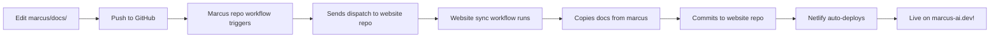

# Marcus AI Website - Complete Setup Guide

This guide walks you through setting up the marcus-ai-website repository with automatic documentation synchronization from the main marcus repository.

## 📋 Prerequisites

- GitHub account with access to both repositories
- Node.js 18+ installed
- Netlify account
- GitHub Personal Access Token (you'll create this)

## 🚀 Quick Setup (5 Steps)

### Step 1: Configure GitHub Actions Token

You need a Personal Access Token (PAT) to allow the marcus repo to trigger documentation sync in the marcus-ai-website repo.

#### Create Token

1. Go to GitHub → Settings → Developer settings → [Personal access tokens](https://github.com/settings/tokens)
2. Click "Generate new token (classic)"
3. Name: `marcus-website-sync`
4. Expiration: No expiration (or set to your preference)
5. Select scopes:
   - ✅ `repo` (full repository access)
   - ✅ `workflow` (update workflows)
6. Generate token and **copy it** (you won't see it again!)

#### Add Token to Marcus Repo

1. Go to [marcus repository](https://github.com/lwgray/marcus)
2. Settings → Secrets and variables → Actions
3. Click "New repository secret"
4. Name: `WEBSITE_SYNC_TOKEN`
5. Value: [paste your token]
6. Click "Add secret"

### Step 2: Initial Documentation Sync

Run the first sync manually to populate documentation:

```bash
# Option A: Using GitHub CLI (recommended)
gh workflow run sync-docs.yml -R lwgray/marcus-ai-website

# Option B: Via GitHub web interface
# 1. Go to: https://github.com/lwgray/marcus-ai-website/actions
# 2. Click "Sync Documentation from Marcus Repo"
# 3. Click "Run workflow" → "Run workflow"

# Option C: Copy manually for first time
cd ~/dev/marcus-ai-website
cp -r ~/dev/marcus/docs/* pages/docs/
git add pages/docs/
git commit -m "Initial documentation sync"
git push
```

### Step 3: Install Dependencies

```bash
cd ~/dev/marcus-ai-website
npm install
```

### Step 4: Test Locally

```bash
# Start development server
npm run dev

# Open browser to http://localhost:3000
# You should see:
# - Landing page at /
# - Documentation at /docs
```

### Step 5: Deploy to Netlify

#### Option A: Netlify Web Interface (Easiest)

1. Go to [app.netlify.com](https://app.netlify.com)
2. Click "Add new site" → "Import an existing project"
3. Choose "GitHub"
4. Select `lwgray/marcus-ai-website` repository
5. Configure build settings:
   - **Build command**: `npm run export`
   - **Publish directory**: `out`
   - **Node version**: 18
6. Click "Deploy site"
7. Site deploys in ~2 minutes!

#### Option B: Netlify CLI

```bash
# Install Netlify CLI
npm install -g netlify-cli

# Login
netlify login

# Deploy
cd ~/dev/marcus-ai-website
netlify deploy --prod
```

### Step 6: Configure Custom Domain

In Netlify dashboard:

1. Go to Site settings → Domain management
2. Click "Add custom domain"
3. Enter: `marcus-ai.dev`
4. Follow DNS configuration instructions
5. Enable HTTPS (automatic after DNS propagates)

## ✅ Verify Everything Works

### Test Documentation Sync

1. Edit a file in `marcus/docs/` (e.g., add a line to README.md)
2. Push to marcus repo
3. Watch GitHub Actions:
   - Marcus repo: "Notify Website" action runs
   - Marcus-ai-website repo: "Sync Documentation" action runs
4. Check website in ~3-4 minutes - changes should appear!

### Test Local Development

```bash
cd ~/dev/marcus-ai-website
npm run dev
```

Visit:
- `http://localhost:3000` - Landing page ✅
- `http://localhost:3000/docs` - Documentation ✅
- `http://localhost:3000/docs/getting-started/quickstart` - Specific page ✅

### Test Production Build

```bash
npm run export
# Should complete without errors
# Creates out/ directory
```

## 🔄 Sync Workflow Explained

### Automatic Sync (Recommended)



### Manual Sync (Backup)

If automatic sync fails, trigger manually:

```bash
# Using GitHub CLI
gh workflow run sync-docs.yml -R lwgray/marcus-ai-website

# Using GitHub web interface
# Go to Actions → Sync Documentation → Run workflow
```

### Daily Backup Sync

A cron job runs daily at 2 AM UTC to catch any missed syncs:

```yaml
schedule:
  - cron: '0 2 * * *'
```

## 📁 Directory Structure After Setup

```
marcus-ai-website/
├── pages/
│   ├── index.mdx              # Landing page
│   ├── docs/                  # Documentation (synced)
│   │   ├── getting-started/
│   │   ├── concepts/
│   │   ├── guides/
│   │   ├── systems/
│   │   ├── api/
│   │   └── roadmap/
│   ├── _app.jsx
│   └── _meta.json
├── .github/
│   └── workflows/
│       └── sync-docs.yml      # Sync automation
├── styles/
│   └── globals.css
├── public/
├── node_modules/
├── out/                       # Build output (git-ignored)
├── package.json
├── next.config.js
├── theme.config.jsx
├── netlify.toml
└── README.md
```

## 🛠️ Customization After Setup

### Add Your Logo

```bash
# Add logo files
cp your-logo-light.svg ~/dev/marcus-ai-website/public/logo/light.svg
cp your-logo-dark.svg ~/dev/marcus-ai-website/public/logo/dark.svg

# Update theme.config.jsx to use them
```

### Change Colors

Edit `styles/globals.css`:
```css
:root {
  --primary-color: #0D9373;  /* Change this */
}
```

### Update Social Links

Edit `theme.config.jsx`:
```jsx
chat: {
  link: 'https://discord.gg/your-discord'
}
```

## 🐛 Troubleshooting

### Sync Not Working

**Check GitHub Actions Token:**
```bash
# In marcus repo, verify secret exists:
# Settings → Secrets and variables → Actions
# Should see: WEBSITE_SYNC_TOKEN
```

**Check Workflow Runs:**
- Marcus repo: Actions → "Notify Website of Documentation Updates"
- Website repo: Actions → "Sync Documentation from Marcus Repo"

**Manual Trigger:**
```bash
gh workflow run sync-docs.yml -R lwgray/marcus-ai-website
```

### Build Fails Locally

```bash
# Clear node_modules and reinstall
rm -rf node_modules package-lock.json
npm install

# Try build again
npm run export
```

### Netlify Deploy Fails

1. Check build logs in Netlify dashboard
2. Verify build command: `npm run export`
3. Verify publish directory: `out`
4. Check Node version is 18

### Documentation Not Showing

```bash
# Verify docs exist locally
ls -la ~/dev/marcus-ai-website/pages/docs/

# If empty, run manual sync
gh workflow run sync-docs.yml -R lwgray/marcus-ai-website

# Or copy manually
cp -r ~/dev/marcus/docs/* ~/dev/marcus-ai-website/pages/docs/
```

## 📊 Monitoring

### GitHub Actions

Monitor sync status:
- Marcus repo: https://github.com/lwgray/marcus/actions
- Website repo: https://github.com/lwgray/marcus-ai-website/actions

### Netlify

Monitor deployments:
- Dashboard: https://app.netlify.com
- Check deploy status, build logs, performance

### Website Health

- Live site: https://marcus-ai.dev
- Docs: https://marcus-ai.dev/docs
- Check regularly after documentation updates

## 🎉 You're Done!

Your website is now set up with automatic documentation synchronization!

### What Happens Now

1. **Edit docs** in `marcus/docs/` → Auto-syncs to website → Auto-deploys
2. **Edit website** in `marcus-ai-website` → Auto-deploys to Netlify
3. **Everything automatic** - just push changes!

### Next Steps

- [ ] Add your logo files
- [ ] Customize colors if desired
- [ ] Update social links
- [ ] Test documentation sync by editing a doc in marcus repo
- [ ] Share your site: marcus-ai.dev

## 📞 Need Help?

- Check [README.md](README.md) for detailed documentation
- Review [NETLIFY_DEPLOY.md](NETLIFY_DEPLOY.md) for deployment details
- Open an issue in marcus repo for questions

---

**Congratulations!** Your Marcus AI website is live with automatic documentation sync! 🚀